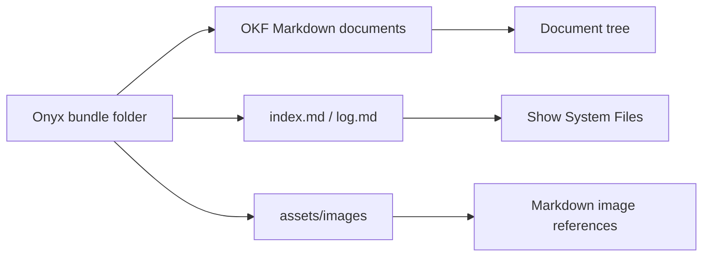
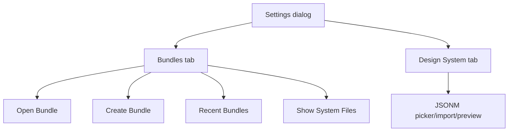
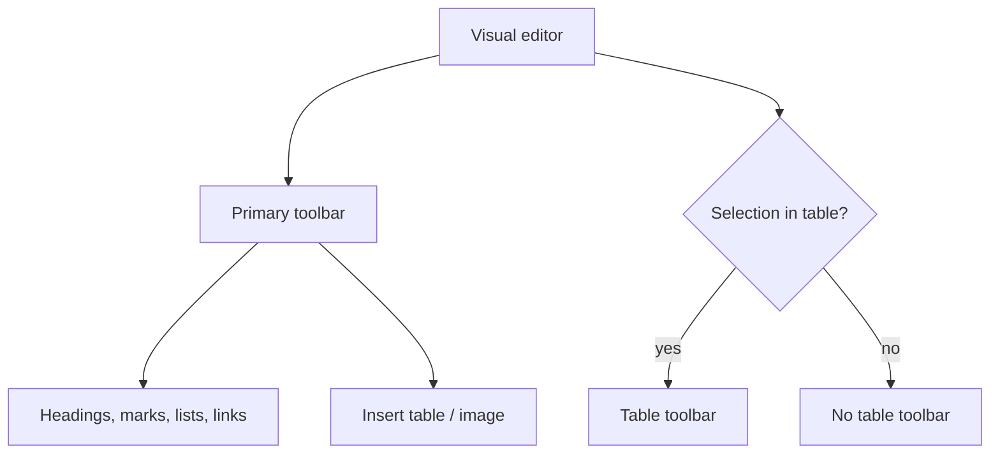

# Bundle UX, Branding, and Rich Editor Tools

Date: 2026-06-15
Milestone: ROU-023

## Bundle Model

A bundle is a folder-backed OKF document space. It contains flat-file OKF Markdown documents, reserved system files, generated index boundaries, and managed bundle-local assets.



## Settings

Settings are split into tabs so bundle management and design-system selection do not compete for the same surface.



## Editor Toolbars

The primary toolbar carries common writing commands. A contextual table toolbar appears only when the selection is inside a table. After ROU-024, Visual/Raw switching and save state are utility controls on the right side of the toolbar.



## Image Assets

Desktop image insertion copies the selected image into `assets/images/` inside the active bundle. Markdown stores relative references such as:

```md

```

This avoids base64 document payloads and keeps bundle content portable.

## Brand Asset

The runtime logo is copied from `.plandocs/logo/onyxwriter-logo.png` into app-owned assets at `src/assets/brand/onyxwriter-logo.png`. The app does not reference `.plandocs` at runtime.
