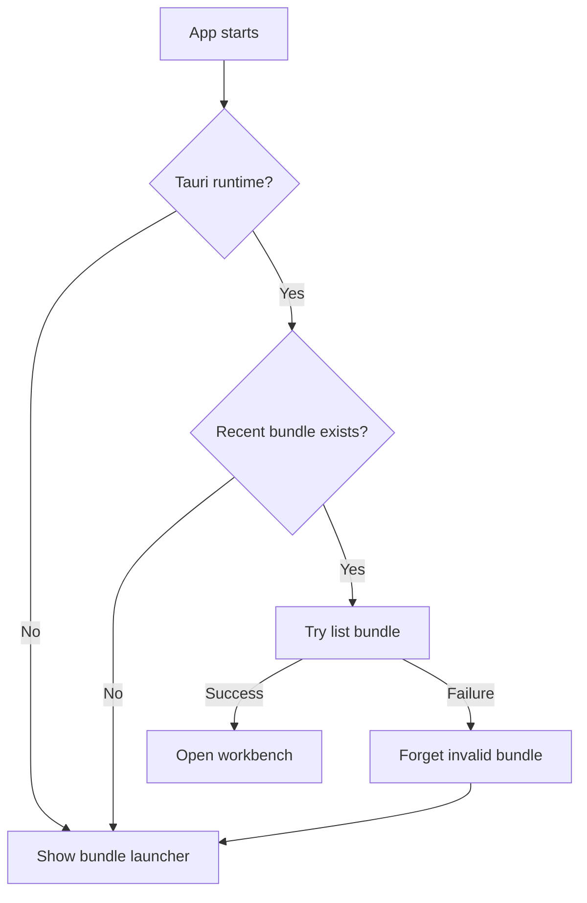
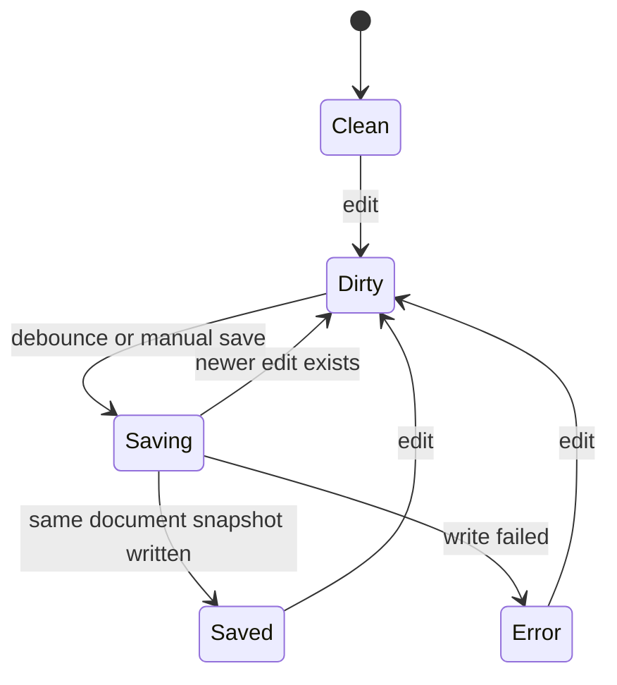
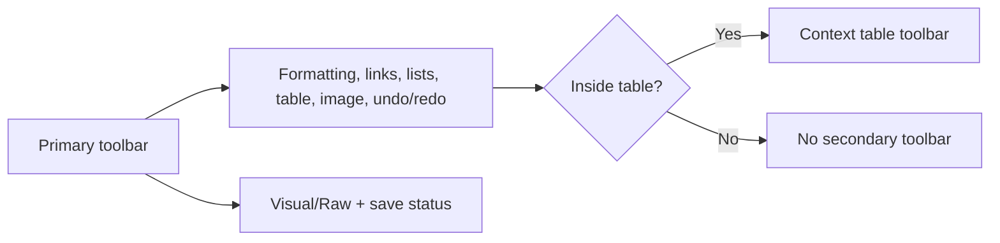

# Bundle Startup, Autosave, and Theme Completion

Date: 2026-06-15
Milestone: ROU-024

## Bundle Startup

onyxwriter treats a bundle as the local OKF document root. In the desktop runtime, startup attempts to restore the most recent bundle metadata record. The browser/MAMP build remains a static preview and only opens the sample bundle through the explicit preview action.

## Autosave Flow

Autosave is the primary save path for bundle-backed documents. Edits mark the document dirty, schedule a debounced write, and use the same scoped Tauri write command as manual save. The write result is applied only if the same bundle/document/raw snapshot is still active.

## Toolbar Placement

Visual editing commands are the primary toolbar controls. Lower-frequency utility controls live in the right cluster: Visual/Raw mode and save status/manual save. The table toolbar remains contextual and appears only when table selection is active.

## JSONM Theme Scope

The selected JSONM design system compiles into constrained CSS custom properties. The runtime appearance mode is applied to the document root and app shell, so app chrome, editor surfaces, settings, validation, and preview use the same tokenized alias layer.

Hardcoded CSS is limited to layout mechanics, minimum dimensions, and fallback values behind token aliases.
