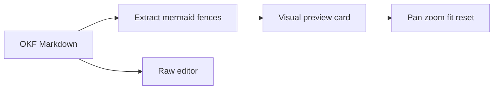
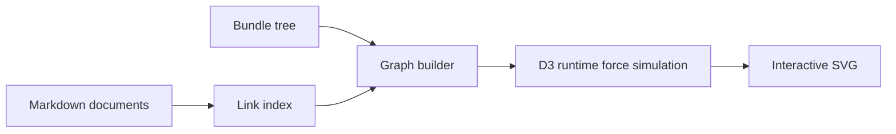

# Mermaid and Bundle Graph Visualizations

## Scope

ROU-025 adds two local visualization surfaces:

- Mermaid fenced blocks render in Visual mode and are edited in Raw mode.
- The bundle graph renders an SVG view of folders, documents, document links, and broken internal links.

Both features are runtime-only views over flat OKF Markdown files. They do not introduce a graph database, background index service, or external rendering CDN.

## Mermaid Flow

Mermaid blocks are stripped from the TipTap editable HTML so diagram source is not accidentally rewritten by the rich-text bridge. The raw Markdown remains the source of truth, and the visual preview renders the diagram from that raw source.

Rendering uses Mermaid with strict security defaults, deterministic IDs, `htmlLabels: false`, and no `startOnLoad` scanning.

## Bundle Graph Flow

The graph builder combines:

- Folder and document containment from the active bundle tree.
- Internal Markdown links from loaded documents.
- Broken relative links as explicit broken nodes.
- Reserved system Markdown files only when system-file visibility is enabled.

The SVG graph supports pan, zoom, fit, reset, filters, hoverable nodes, and document-node selection.

ROU-030 keeps the graph SVG-based and upgrades the layout from a precomputed force result to a controlled runtime simulation. Nodes are initialized deterministically, then animated by D3 force rules that differentiate containment from document links. The runtime keeps references to active nodes and edges so drag interactions can pin a node temporarily, reheat the simulation, and then release the node back into a settling layout.

Dense-bundle readability is handled through smaller degree-aware nodes, label truncation, lighter containment edges, stronger connected-neighborhood highlighting, and dimming for unrelated content while a node is hovered or keyboard-focused. The graph measures its container and computes fit/reset transforms from the current graph bounds rather than a fixed canvas assumption.

## Verification

Core behavior is covered by unit tests for Mermaid block extraction, markdown capability policy, viewport math, link indexing, graph construction, D3 layout resolution, graph physics helpers, hover highlighting, and node drag/click separation. Smoke tests cover the OKF fixture Mermaid path and bundle graph fixture path.
