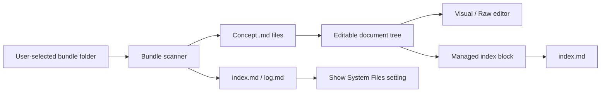

# Bundle and Editor Hardening

Date: 2026-06-15
Milestone: ROU-022

## Bundle Root Primitive

An Onyx bundle is a user-selected directory that stores OKF documents as flat Markdown files. onyxwriter derives the editable document tree from concept documents and treats `index.md` and `log.md` as reserved system files.



## Editor Safety Policy

Visual editing is allowed only for the Markdown subset the bridge can currently round-trip. After ROU-023, that includes headings, paragraphs, bullet lists, ordered lists, links, bold, italic, inline code, simple tables, and bundle-local images. Fenced code blocks, HTML, nested lists, blockquotes, thematic breaks, link definitions, and complex tables are raw-mode guarded so visual mode does not silently rewrite them.

## Reserved Files

`index.md` and `log.md` are hidden from the normal document tree by default. Settings can reveal them as system entries. Root `index.md` may carry `okf_version`; nested `index.md` and `log.md` are not concept documents and do not require `type` frontmatter.

The index manager only owns content between:

```md
<!-- onyxwriter:index:start -->
<!-- onyxwriter:index:end -->
```

Content outside those markers is preserved.

## Local Viewing

During development, Vite serves transformed TypeScript/React at `http://127.0.0.1:1420/`. MAMP Pro can serve `https://onyxwriter:8890/` by pointing its host document root at `dist`. That MAMP URL reflects the most recent production build, so verification runs `npm run build` before user-facing review.
