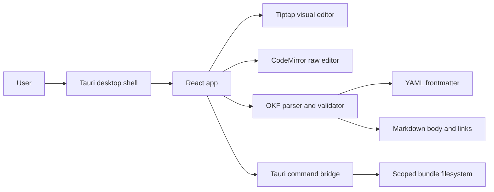

# OKF Editor Foundation

## Architecture

## Boundaries

- Tauri owns local filesystem access.
- React owns interface state and editing interactions.
- OKF core owns parse, serialize, validate, and link analysis behavior.
- User document content remains in flat files under the opened bundle root.

## License Posture

The app is MIT. Tauri, Tiptap/ProseMirror, CodeMirror, React, and Vite are compatible with that posture for the selected open-source packages. Tiptap Pro/Cloud/Platform packages and GPL/AGPL dependencies remain out of scope for this milestone.
