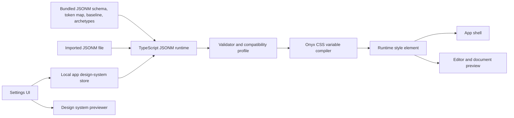

# JSONM Design System Runtime

## Architecture

## Boundaries

- JSONM is declarative JSON data only.
- Imported design systems are app configuration and are stored outside OKF bundles.
- The compiler emits constrained `--onyx-*` variables from the approved token map.
- Application CSS consumes a smaller `--ow-*` alias layer for app shell, bundle rail, toolbar, settings, validation, raw editor, and editor surfaces.
- The active appearance mode is applied to the runtime document root and app shell, not only to the design-system preview.
- Known non-executable font-role extension fields are accepted for archetype compatibility, but unsupported fields are not mapped into executable styling.
