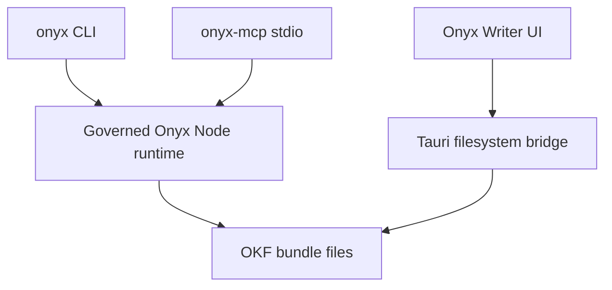

# Agent Access Core

ROU-057 adds governed local agent access to Onyx Writer bundles through two surfaces:

- `onyx` CLI for shell-first agents, humans, scripts, and CI.
- `onyx-mcp` stdio sidecar for MCP-capable agent IDEs.

Both surfaces must route through the same bundle rules. They are not raw filesystem access wrappers.

## Ownership Boundary

| Capability | Canonical owner |
| --- | --- |
| Bundle root/path safety | `src/lib/onyx-core/nodeRuntime.mjs` for CLI/MCP; `src-tauri/src/okf_fs.rs` remains the desktop disk boundary |
| Workspace tree shape | `src/lib/workspace/tree.ts` in UI, mirrored by `nodeRuntime.mjs` for Node-side tools |
| OKF validation | `src/lib/okf/*` in UI, mirrored by `nodeRuntime.mjs` for Node-side tools |
| Reserved files | `index.md` and `log.md` are system files; concept mutation tools reject them |
| Deterministic indexes | Managed regions bounded by `onyxwriter:index` comments |
| Link repair | Markdown links are repaired after governed move/rename operations |
| Assets | Image assets are constrained to supported image extensions and bundle-local paths |
| Write preconditions | CLI/MCP document updates accept hash/mtime preconditions and return conflicts instead of silent overwrites |
| Audit | CLI/MCP writes append metadata-only records to `.onyx-agent-audit.jsonl` |

## Runtime Shape

The desktop app remains lightweight. No localhost HTTP server, background daemon, or remote listener is introduced in this milestone.

## Drift Risks

The current desktop UI uses Rust commands for disk access and TypeScript helpers for validation, indexes, and link repair. The CLI/MCP side uses a Node runtime mirror so it can run outside the browser/Tauri process. That creates a drift risk.

Mitigation:

- Keep CLI/MCP behavior covered by regression tests.
- Keep the agent runtime conservative and close to existing rules.
- Treat future deeper extraction into a shared Rust/TypeScript package as an optimization, not a prerequisite for this first agent-access slice.

## Authorized Mutation Surface

The agent-access layer supports:

- bundle info/tree/validation,
- document create/read/update/move/rename/delete,
- asset import/read,
- deterministic index refresh,
- link checking,
- graph export.

It does not expose:

- arbitrary filesystem writes,
- out-of-bundle path access,
- localhost HTTP MCP,
- remote sync,
- encryption,
- account or hosted storage behavior.
