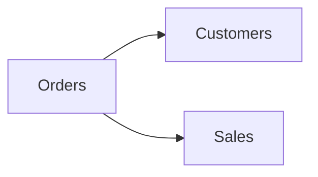

# Schema

| Column | Type | Notes |
| --- | --- | --- |
| order_id | string | Primary key |
| customer_id | string | Links to [Customers](customers.md) |
| order_total | number | Gross order value |

# Diagram

